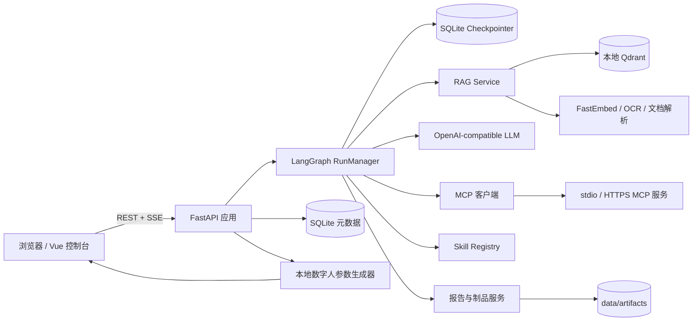
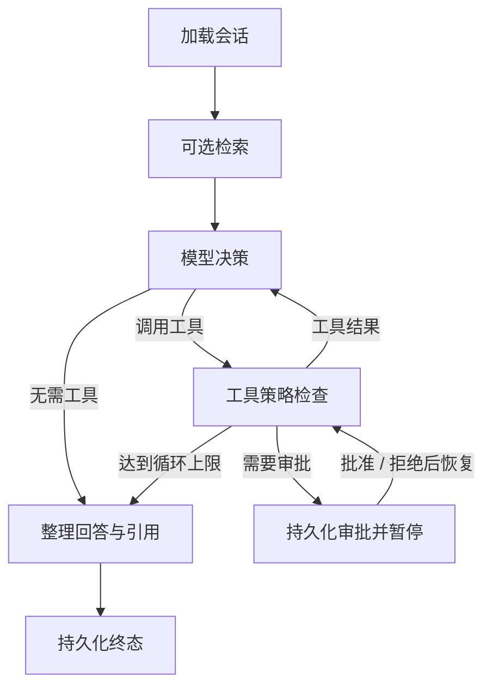

# Hi-agent 架构

## 概览

Hi-agent 是一个本地优先的 Agent 运行平台。单个 FastAPI 进程负责 API、认证、持久化、
LangGraph 编排、RAG、MCP/Skill 工具调用和静态 Web 资源；Vue 控制台通过 REST 与 SSE
访问它。模型端点遵循 OpenAI-compatible `/v1` 接口，但平台不会在端点不可用时隐式切换云服务。

## 组件职责

### Web 控制台

`web/src/` 管理登录、项目、Agent、模型端点、知识库、MCP、Skills、会话、Run、制品和运维视图。
`web/src/api.ts` 是主要 API 边界，`web/src/types.ts` 保存前端契约类型。SSE 客户端负责增量事件、
断线重连和终态展示。

### API 与认证

`backend/src/hi_agent/main.py` 创建应用、初始化目录/数据库/默认资源并挂载静态页面。
`api.py` 聚合 `/api/v1` 核心资源接口，内容生成和下载路由独立放在 `artifact_api.py`；
`api_support.py` 提供统一的租户资源读取和 CRUD 辅助函数，`auth.py` 处理会话、验证码、身份映射和 CSRF。
所有租户资源必须以当前用户为边界；直接访问他人资源返回 404。

### 持久化

`database.py` 管理 SQLite 和初始化迁移，`models.py` 定义用户、项目、Agent、知识库、会话、
Run、事件、审批和配置快照等模型。SQLite 使用 WAL；LangGraph checkpointer 使用独立 SQLite 文件。
运行数据默认位于 `data/`，它不是源码的一部分。

Agent Revision 和 Run 的配置字段由 `agent_config.py` 统一生成，避免 API、启动种子和运行时各自维护
字段清单而产生快照漂移。

### Agent 执行

`runtime.py` 中的 `RunManager` 构建固定 LangGraph：

Run 的用户可见转换会写入事件表，SSE 使用事件 ID 回放。Agent、模型、知识库和 MCP 配置会在
运行开始时快照，避免执行中配置变更破坏可追溯性。写入/执行工具必须审批；取消、超时、重启中断
和工具循环上限都应产生明确终态。

### RAG

`rag.py` 负责文档提取、分块、嵌入、BM25/Dense 检索、RRF 融合和引用。PDF 优先读取文字层，
扫描页可由 `ocr.py` 回退处理。检索片段以不可信数据进入模型；回答引用保留文件、页码（可用时）、
块编号和分数。文档生命周期要求元数据、文件和向量一致创建/删除。

### MCP 与 Skills

`mcp_client.py` 支持 stdio 和 Streamable HTTP。stdio 不经过 shell；远程 HTTP 只允许 HTTPS 且受
双层开关控制。工具按只读、联网、写入、执行分级。

`mcp_presets.py` 提供默认禁用、固定版本的常用服务配置。启动只向初始化管理员补齐缺失的内置
预置，不覆盖同名配置，也不下载或启动第三方服务；实际制品仅在管理员主动探测或调用时获取。

`skills.py` 对 `skills/` 下的 `SKILL.md` 做渐进加载。模型先看到元数据，显式加载后才读取完整指令
和列出的资源。脚本默认关闭；允许的脚本仍属于 execute 风险并要求审批。远程 Skill 的发现、下载、
版本锁定、哈希校验与扫描不能执行制品内代码。

### 报告与制品

`reports.py` 根据完成 Run 的快照生成带引用的 Markdown、DOCX 或 PDF 报告。
`artifacts.py` 管理文档、幻灯片和图片，并限制文件大小、格式和存储路径。`ArtifactsView.vue`
提供图片、通用报告、PPTX 与智能体 Run 报告的统一生成入口；Run 报告从租户隔离的终态 Run、
不可变配置快照和事件统计生成并关联原始 `run_id`。

### 动态数字人

`digital_human.py` 把不可信的自然语言描述确定性映射为闭合的形象参数，不生成或解析用户提供的
SVG/HTML。每个租户都预置不可变的 `digital_human` 类型 Agent；`DigitalHumanView.vue` 和
`DigitalAvatar.vue` 在浏览器中将参数组合成动态 2D SVG。该链路不依赖模型端点、不联网，并尊重
减少动态效果偏好。详细取舍见 [动态数字人设计](DIGITAL_HUMAN.md)。

## 关键数据流

1. 用户登录并选择项目、Agent 与会话。
2. API 创建 Run、消息和初始事件，`RunManager` 启动图执行。
3. 若 Agent 绑定知识库，RAG 返回带来源的片段。
4. 模型产生回答或工具调用；策略层自动执行只读能力，或创建审批并暂停。
5. SSE 持续读取已持久化事件；重连时从 `Last-Event-ID`/`after` 继续。
6. 图整理引用并写入终态；报告或制品按独立请求生成。

## 不变量

- 本地优先：默认回环监听，模型不可用时显式失败。
- 租户隔离：所有项目资源都归属用户，跨用户访问不泄露存在性。
- 可恢复：事件和 checkpoint 先持久化，审批后可继续，进程重启有明确状态。
- 可审计：Run 使用配置快照，工具调用、审批、引用和错误可追踪。
- 最小权限：远程访问、Skill 脚本、写入和执行能力默认关闭或需要批准。
- 密钥分离：持久化环境变量名而不是密钥值。

## 扩展位置

- 新 REST 资源：在 `schemas.py`、`models.py`、`api.py` 中保持 schema、存储和路由同步。
- 新 Run 节点：在 `runtime.py` 中定义状态输入/输出、边、事件和恢复语义。
- 新文档格式：在 RAG 提取层增加大小/资源限制、测试和引用映射。
- 新 MCP 传输或工具：在 `mcp_client.py` 中补全初始化超时、风险分类和审批测试。
- 新 Skill：在 `skills/<name>/` 创建有效 `SKILL.md`，仅添加任务真正需要的引用或资源。
